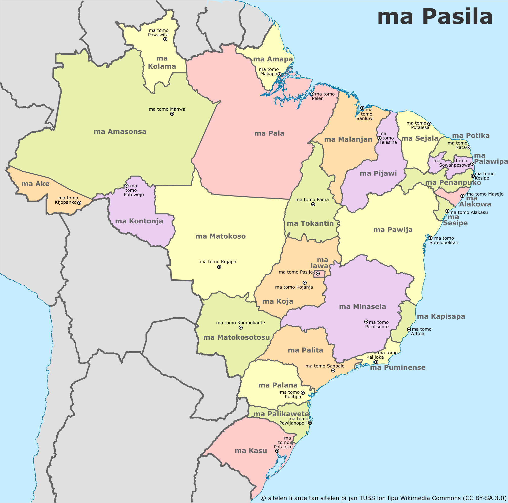

## Regras gerais

1. Toda sílaba tem uma consoante, uma vogal, e pode terminar com um **n** opcional.
2. Apenas a primeira sílaba pode começar com uma vogal, e terminar com **n** também opcional.
3. As sílabas **ti** e **tin** são trocadas pelas sílabas **si** e **sin**, respectivamente.
4. A letra **w** não pode aparecer antes de **o** ou **u**.
5. A letra **j** não pode aparecer antes de **i**.

## Guia fonético

O guia abaixo facilita a tradução de sons do português para toki pona, já que a língua possui um número reduzida de letras. Atente-se que o som delas pode variar para outros idiomas e até mesmo sotaques.

Som em português | Equivalente em toki pona
-|-
ã (em maç**ã**) | an
b (em **b**alão) | p
c/q (em **c**asa) | k
c/s/sc (em **c**ego) | s
d (em **d**ica) | t
f (em **f**aca) | p
g (em **g**osto) | k
g/j (em **g**ente) | s
lh (em pa**lh**a) | l
nh (em se**nh**or) | -nj-
r (em pa**r**ar) | l
rr/r (em ca**rr**oça) | k
r (em ca**r**ta, [no dialeto caipira](https://pt.wikipedia.org/wiki/Dialeto_caipira)) | w
v (em **v**ida) | w
x/ch (em **x**ícara) | s
z (em **z**arpar) | s

- ...
- Se a palavra se assemelha com uma palavra oficial em toki pona, adapte-a para não ser confundida. Por exemplo, o nome "Carla" viraria "Kala" pelas regras acima e causar confusão ao conversar sobre "jan kala" (pessoa-peixe). Neste caso, você poderia substituir o nome por "jan Kawa", por exemplo.

Se tiver dificuldades em bolar o seu nome em toki pona, o _website_ [tokipona.net](http://tokipona.net/tp/Transliterate.aspx?Tour=true) possui uma ferramenta para transcrever o seu nome automagicamente. Em português, você geralmente irá usar a opção do resultado "Trilled Tapped R", que seria o som de pa**r**ar na tabela acima.

## Lista de nomes

### Línguas

Abaixo, foram reproduzidas algumas das línguas mais comuns. Para ver uma lista completa em inglês, veja [jan Pije (reproduzido de _Toki Pona: The Language of Good_)](http://tokipona.net/tp/janpije/languagenames.php).

- **_toki Potuke_** - Português
- **_toki luka Pasila_** - Libras
- **_toki luka Potuke_** - LGP
- _toki Epanja_ - Espanhol
- _toki Kale_ - Galego
- _toki Milante_ - Mirandês
- _toki Inli_ - Inglês
- _toki Italija_ - Italiano
- _toki Netelan_ - Holandês
- _toki Kanse_ - Francês
- _toki Tosi_ - Alemão
- _toki Posuka_ - Polonês
- _toki Kijolo_ - Crioulo
- _toki Emakuwa_ - Macua
- _toki Nijon_ - Japonês
- _toki Sonko_ - Mandarim
- _toki Insi_ - Hindi
- _toki Alapi_ - Árabe
- _toki Losi_ - Russo
- _toki Tupinanpa_ - Tupinambá
- _toki Jenkatu_ - Nheengatu
- _toki Tikuna_ - Tikuna
- _toki Kalanikajowa_ - Guarani-Kaiowá
- _toki Epelanto_ - Esperanto

### Continentes e países

Abaixo, foram reproduzidos apenas alguns países. Para ver uma lista completa em inglês, veja [jan Pije (reproduzido de _Toki Pona: The Language of Good_)](http://tokipona.net/tp/janpije/placenames.php).

- _ma Amelika_ - Américas
- _ma Antasika_ - Antártica
- _ma Apika_ - África
- _ma Asija_ - Ásia
- _ma Elopa_ - Europa
- _ma Osejanija_ - Oceania

---

- **_ma Pasila_** - Brasil
- **_ma Potuke_** - Portugal
- **_ma Mosanpi_** - Moçambique
- **_ma Ankola_** - Angola
- **_ma Kapowete_** - Cabo Verde
- **_ma Santomejepinsipe_** - São Tomé e Príncipe
- **_ma Kinepisa_** - Guiné-Bissau
- **_ma Kinejekatolija_** - Guiné-Equatorial
- **_ma Timolete_** - Timor-Leste
- **_ma Maka_** - Macau
- _ma Epanja_ - Espanha
- _ma Kale_ - Galícia
- _ma Italija_ - Itália
- _ma Tosi_ - Alemanha
- _ma Lusepu_ - Luxemburgo
- _ma Antola_ - Andorra
- _ma Kanse_ - França
- _ma Suwasi_ - Suíça
- _ma Netelan_ - Holanda
- _ma Inli_ - Inglaterra
- _ma Juke_ - Reino Unido
- _ma Losi_ - Rússia
- _ma Tuki_ - Turquia
- _ma Alensina_ - Argentina
- _ma Palakawi_ - Paraguai
- _ma Ulukawi_ - Uruguai
- _ma Sile_ - Chile
- _ma Penesuwela_ - Venezuela
- _ma Mesiko_ - México
- _ma Mewika_ - Estados Unidos
- _ma Kanata_ - Canadá
- _ma Palata_ - Índia
- _ma Nijon_ - Japão
- _ma Sonko_ - China
- _ma Anku_ - Coreia do Sul
- _ma Lunpan_ - Líbano
- _ma Aja_ - Armênia
- _ma Sulija_ - Síria
- _ma Sawusi_ - Arábia Saudita
- _ma Setapika_ - África do Sul
- _ma Namipija_ - Namíbia
- _ma Naselija_ - Nigéria
- _ma Masu_ - Egito
- _ma Oselija_ - Austrália
- _ma Nusilan_ - Nova Zelândia
- _ma Intonesija_ - Indonésia

### Mapa do Brasil

Você pode usar o mapa do Brasil abaixo para descobrir o nome dos estados e suas capitais.

