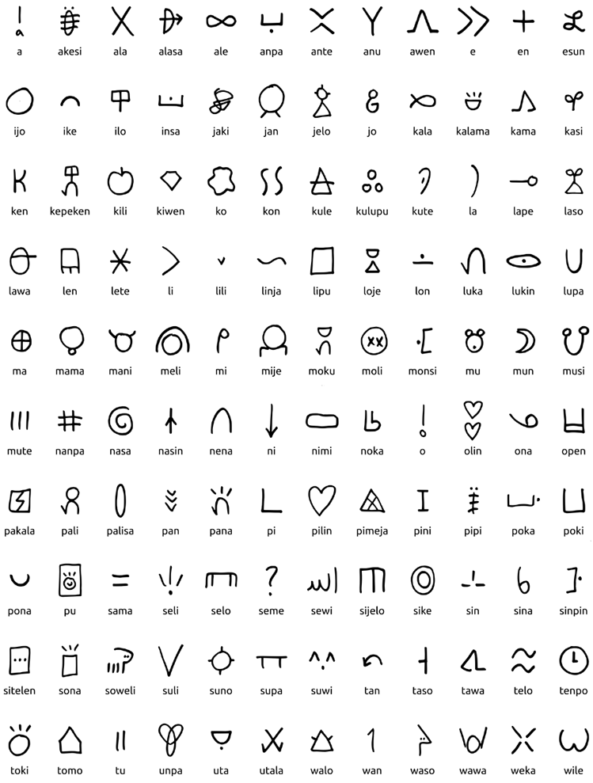
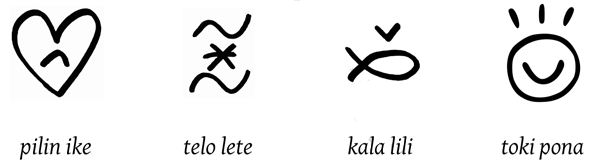
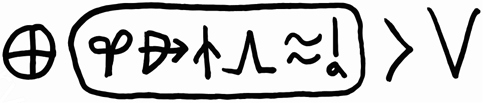
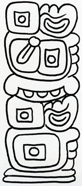
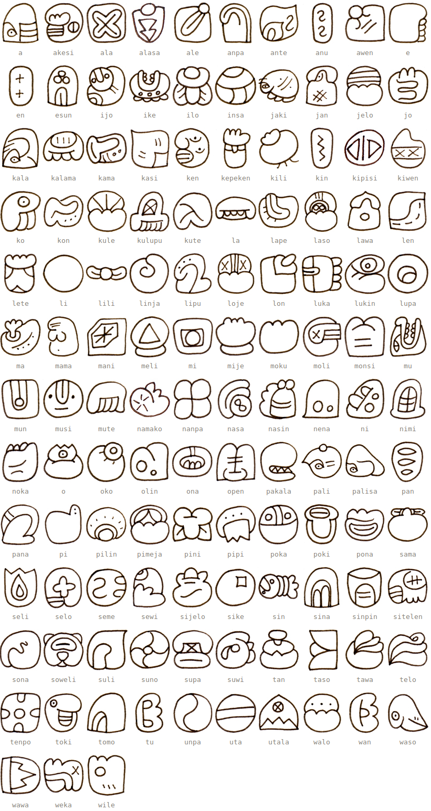
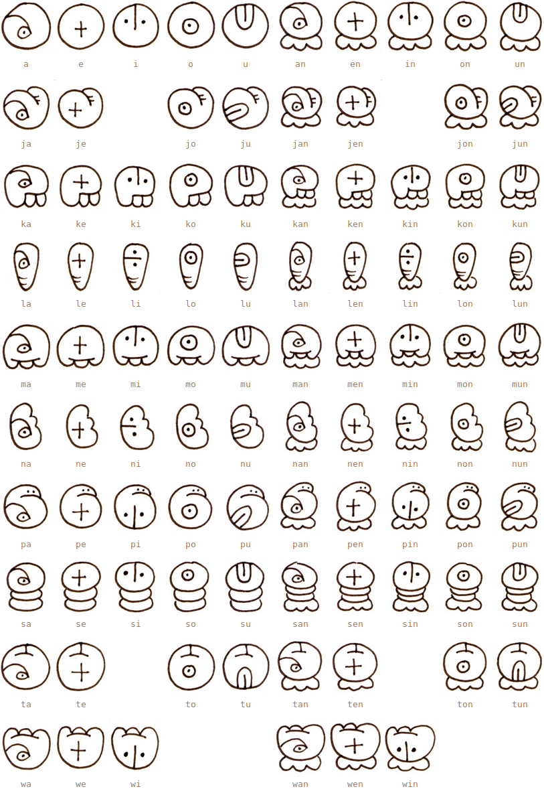
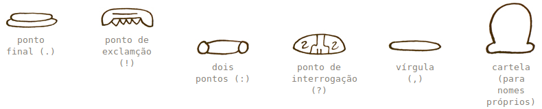

# Sistemas de escrita

Oficialmente, escreve-se em toki pona com o alfabeto latino, como você viu em todo este curso. Também é possível escrever usando outros alfabetos letra-a-letra (grego, cirílico) ou sílaba-a-sílaba (árabe, japnês, tengwar). Porém, como possui um número bem pequeno de palavras, a língua possui alguns sistemas alternativos de escrita (_sitelen_pona_, _sitelen sitelen_), além de uma linguagem de sinais (_toki pona luka_).

Aqui, focaremos apenas nos novos sistemas de escrita. Se quiser saber mais sobre os sistemas que não foram cobertos aqui, [veja as referências](referencias.md#sistemas-de-escrita).

## _sitelen pona_

Este sistema de escrita linear, criado por Sonja Lang, utiliza um símbolo para cada palavra em toki pona. Abaixo, veja uma tabela reproduzida do livro **Toki Pona: The Language of Good**.

As frases são escritas da esquerda para a direita, sem pontuação. Se uma palavra serve como adjetivo da anterior, você pode desenhá-la inscrita dentro do substantivo:

Para escrever nomes próprios, desenhe uma cartela oval com uma palavra oficial que comece com cada letra. Você pode usar símbolos diferentes de acordo com algum significado (para a letra **w**, você poderia usar _wawa_ ou _waso_ ou qualquer outra começando com essa letra).

Por exemplo, podemos escrever _Kanata_ (Canadá) com os símbolos "**k**asi **a**lasa **n**asin **a**wen **t**elo **a**", e colocá-los em uma cartela como na frase abaixo (_ma Kanata li suli._):

## _sitelen sitelen_

Embora não seja um sistema de escrita oficial, _sitelen sitelen_ é reconhecido por muitos falantes de toki pona. Ele é um sistema de escrita não-linear criado por Jonathan Gabel, inspirado na escrita maia, onde os textos são construídos parecidos com "tótens". A frase abaixo é um exemplo da escrita (_mi pona e ale mi la mi pona e mi._)

Diferentemente de _sitelen pona_, ele possui três tipos de símbolos ao invés de um:

1. Todas as palavras oficiais em toki pona.

    

2. Sílabas individuais; utilizadas principalmente para nomes próprios.

    

3. Pontuação e cartela para nomes próprios.

    

Devido à complexidade deste sistema, aqui não será explicado como ele funciona. Se você souber inglês e quiser aprender a ler/escrever textos em _sitelen sitelen_, veja as [lições no site original](https://www.jonathangabel.com/archive/2012/learn_t47.html).

