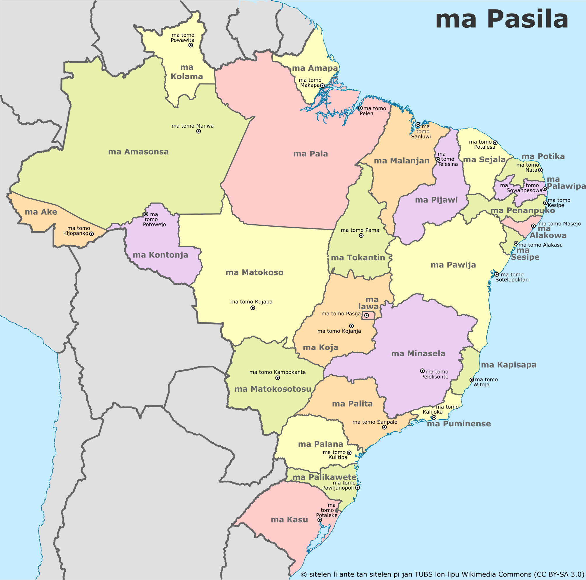

# Listas de nomes próprios

## Línguas

Abaixo, foram reproduzidas algumas das línguas mais comuns, com algumas adições culturais lusofônicas. Para ver toda a lista oficial em inglês, entre em [jan Pije (reproduzido de _Toki Pona: The Language of Good_)](http://tokipona.net/tp/janpije/languagenames.php).

- **_toki Potuke_** - Português
- **_toki luka Pasila_** - Libras
- **_toki luka Potuke_** - LGP
- _toki Epanja_ - Espanhol
- _toki Kale_ - Galego
- _toki Milante_ - Mirandês
- _toki Inli_ - Inglês
- _toki Italija_ - Italiano
- _toki Netelan_ - Holandês
- _toki Kanse_ - Francês
- _toki Tosi_ - Alemão
- _toki Posuka_ - Polonês
- _toki Kijolo_ - Crioulo
- _toki Emakuwa_ - Macua
- _toki Nijon_ - Japonês
- _toki Sonko_ - Mandarim
- _toki Insi_ - Hindi
- _toki Alapi_ - Árabe
- _toki Losi_ - Russo
- _toki Tupinanpa_ - Tupinambá
- _toki Jenkatu_ - Nheengatu
- _toki Tikuna_ - Tikuna
- _toki Kalanikajowa_ - Guarani-Kaiowá
- _toki Epelanto_ - Esperanto

## Continentes e países

Abaixo, foram reproduzidos apenas alguns países, com algumas adições culturais lusofônicas. Para ver toda a lista oficial em inglês, entre em [jan Pije (reproduzido de _Toki Pona: The Language of Good_)](http://tokipona.net/tp/janpije/placenames.php).

- _ma Amelika_ - Américas
- _ma Antasika_ - Antártica
- _ma Apika_ - África
- _ma Asija_ - Ásia
- _ma Elopa_ - Europa
- _ma Osejanija_ - Oceania

---

- **_ma Pasila_** - Brasil
- **_ma Potuke_** - Portugal
- **_ma Mosanpi_** - Moçambique
- **_ma Ankola_** - Angola
- **_ma Kapowete_** - Cabo Verde
- **_ma Santomejepinsipe_** - São Tomé e Príncipe
- **_ma Kinepisa_** - Guiné-Bissau
- **_ma Kinejekatolija_** - Guiné-Equatorial
- **_ma Timolete_** - Timor-Leste
- **_ma Maka_** - Macau
- _ma Epanja_ - Espanha
- _ma Kale_ - Galícia
- _ma Italija_ - Itália
- _ma Tosi_ - Alemanha
- _ma Lusepu_ - Luxemburgo
- _ma Antola_ - Andorra
- _ma Kanse_ - França
- _ma Suwasi_ - Suíça
- _ma Netelan_ - Holanda
- _ma Inli_ - Inglaterra
- _ma Juke_ - Reino Unido
- _ma Losi_ - Rússia
- _ma Tuki_ - Turquia
- _ma Alensina_ - Argentina
- _ma Palakawi_ - Paraguai
- _ma Ulukawi_ - Uruguai
- _ma Sile_ - Chile
- _ma Penesuwela_ - Venezuela
- _ma Mesiko_ - México
- _ma Mewika_ - Estados Unidos
- _ma Kanata_ - Canadá
- _ma Palata_ - Índia
- _ma Nijon_ - Japão
- _ma Sonko_ - China
- _ma Anku_ - Coreia do Sul
- _ma Lunpan_ - Líbano
- _ma Aja_ - Armênia
- _ma Sulija_ - Síria
- _ma Sawusi_ - Arábia Saudita
- _ma Setapika_ - África do Sul
- _ma Namipija_ - Namíbia
- _ma Naselija_ - Nigéria
- _ma Masu_ - Egito
- _ma Oselija_ - Austrália
- _ma Nusilan_ - Nova Zelândia
- _ma Intonesija_ - Indonésia

### Mapa do Brasil

Você pode usar o mapa abaixo para descobrir o nomeem toki pona dos estados do Brasil e suas capitais.

